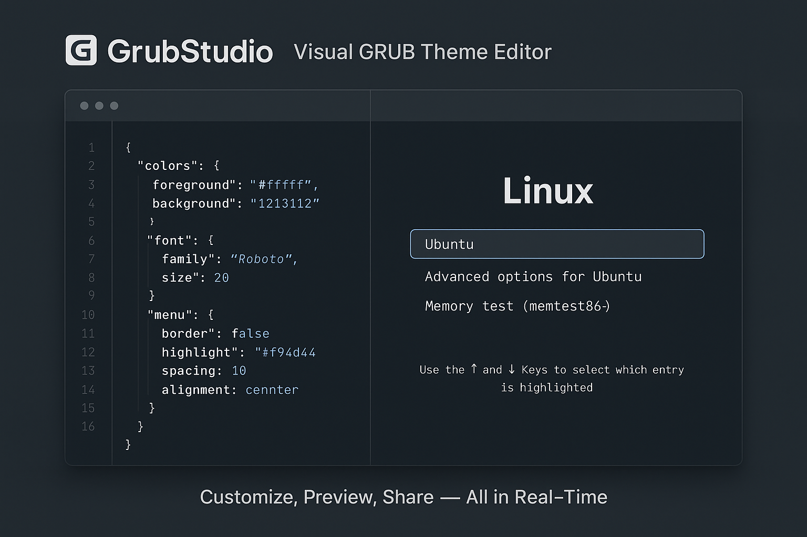

<h1 align = center>
🧰 GrubStudio
  
</h1>

<p align = center>
   A modern GRUB theme editor + previewer with live rendering and a public theme marketplace — all in your browser.

</p>



---

## 🚀 What is GrubStudio?

**GrubStudio** is an open-source web app that lets Linux users and theme developers:

- 🎨 **Edit GRUB themes** in real-time (syntax-highlighted editor)
- 🔍 **Live preview** themes with accurate rendering
- 🌍 **Explore & share** GRUB themes in a public marketplace
- 📂 **Manage theme files** like fonts, images, and configs
- 👤 **Log in** to save drafts, publish themes, or star favorites

Built for tinkerers, themers, and open-source lovers.

---

## ✨ Features

- 🖋️ Monaco/CodeMirror-based syntax editor
- 🖼️ Instant boot menu-style live preview
- 📁 Sidebar for uploading custom assets (images, fonts)
- 🧰 Full-featured theme management dashboard
- 🛍️ Community-powered marketplace (download, rate, favorite themes)
- 🔐 OAuth-based login (GitHub/Google)
- 📦 Export complete themes as `.zip`

---

## 🧱 Tech Stack

| Layer          | Tech                                                      |
|----------------|-----------------------------------------------------------|
| Frontend       | Next.js (App Router), Tailwind CSS, ShadCN UI             |
| Editor         | Monaco Editor or CodeMirror                               |
| Preview Engine | WebAssembly / Canvas (Custom GRUB Renderer)               |
| Backend        | Node.js + Express/Fastify                                 |
| Database       | PostgreSQL + Prisma                                       |
| Storage        | Supabase / R2-compatible for asset uploads                |
| Auth           | NextAuth.js (GitHub, Google OAuth)                        |
| Deployment     | Vercel (frontend), Railway / Fly.io (backend & DB)        |

---

## 📸 Screenshots (Coming Soon)

> Add real screenshots or preview gifs here later:
- `/assets/editor-preview.png`
- `/assets/theme-marketplace.png`
- `/assets/dashboard-themes.png`

---

## 🛠️ Local Development

```bash
# Clone the repo
git clone https://github.com/yourusername/grubstudio.git
cd grubstudio

# Install dependencies
pnpm install

# Start development
pnpm dev
